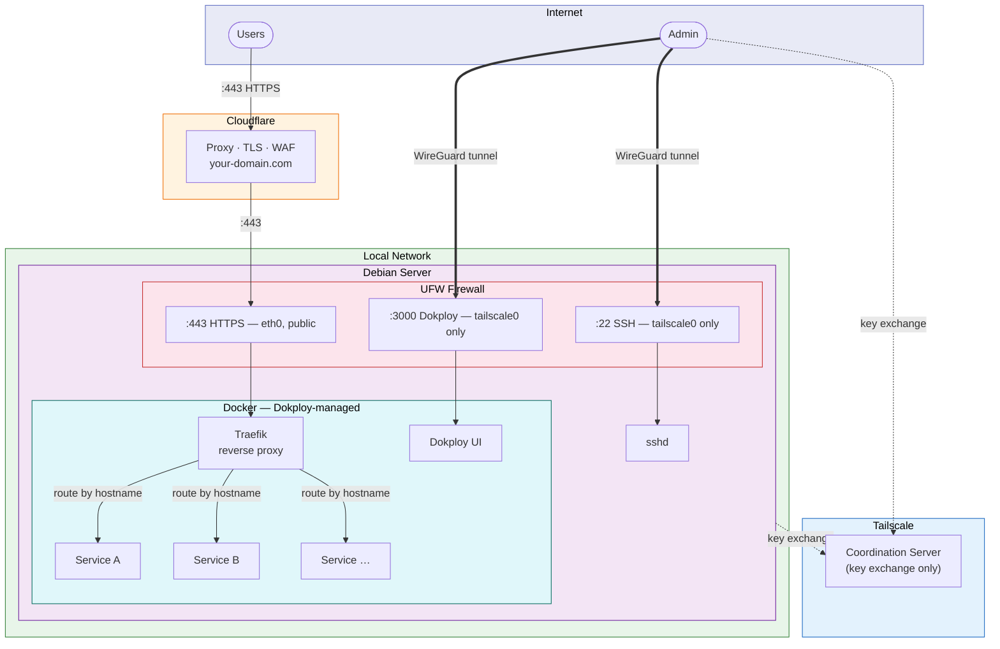

# Network Architecture

```mermaid
flowchart TD
    subgraph INET["Internet"]
        Users(["Users"])
        Admin(["Admin"])
    end

    subgraph CF["Cloudflare"]
        CFProxy["Proxy · TLS · WAF\nyour-domain.com"]
    end

    subgraph TS_NET["Tailscale"]
        TS_CTRL["Coordination Server\n(key exchange only)"]
    end

    subgraph LAN["Local Network"]
        subgraph SERVER["Debian Server"]
            subgraph UFW["UFW Firewall"]
                PUB443[":443 HTTPS — eth0, public"]
                TS22[":22 SSH — tailscale0 only"]
                TS3000[":3000 Dokploy — tailscale0 only"]
            end
            subgraph DOCKER["Docker  —  Dokploy-managed"]
                TRAEFIK["Traefik\nreverse proxy"]
                DOKPLOY["Dokploy UI"]
                SVCA["Service A"]
                SVCB["Service B"]
                SVCN["Service …"]
            end
            SSHD["sshd"]
        end
    end

    Users -- ":443 HTTPS" --> CFProxy
    CFProxy -- ":443" --> PUB443
    PUB443 --> TRAEFIK
    TRAEFIK -- "route by hostname" --> SVCA & SVCB & SVCN

    Admin -. "key exchange" .-> TS_CTRL
    SERVER -. "key exchange" .-> TS_CTRL
    Admin == "WireGuard tunnel" ==> TS22 & TS3000
    TS22 --> SSHD
    TS3000 --> DOKPLOY

    classDef internet fill:#e8eaf6,stroke:#5c6bc0,color:#000
    classDef cloudflare fill:#fff3e0,stroke:#ef6c00,color:#000
    classDef tailscale fill:#e3f2fd,stroke:#1565c0,color:#000
    classDef lan fill:#e8f5e9,stroke:#2e7d32,color:#000
    classDef server fill:#f3e5f5,stroke:#6a1b9a,color:#000
    classDef firewall fill:#fce4ec,stroke:#c62828,color:#000
    classDef docker fill:#e0f7fa,stroke:#00695c,color:#000

    class INET internet
    class CF cloudflare
    class TS_NET tailscale
    class LAN lan
    class SERVER server
    class UFW firewall
    class DOCKER docker
```
